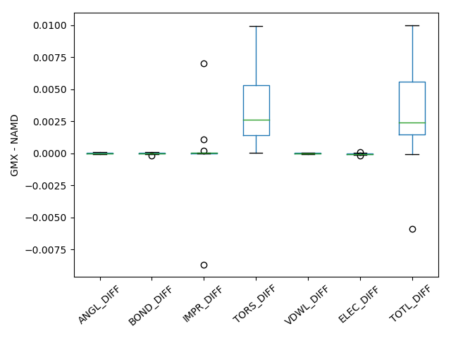
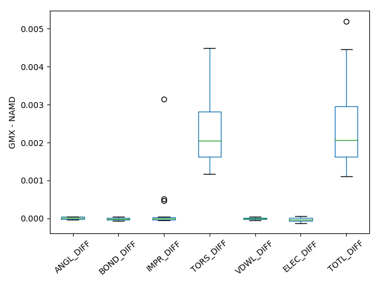

# Implementing OPLS-AA/M Force Field in Gromacs: Lessons Learnt

### Leela S. Dodda (leela.dodda@yale.edu)

Recently Jorgensen group has designed OPLS-AA/M force field for proteins and implemented it in NAMD, MCPRO programs. This study summarizes the key lessons learnt during the implementation of OPLS-AA/M force field in Gromacs, one of the most widely used molecular simulation packages.  

### CITATION: 
This work has been done as part of LigParGen webserver.  If you use this implementation, please cite the following references. 

**
•	Improved Peptide and Protein Torsional Energetics with the OPLS-AA Force Field Michael J. Robertson, Julian Tirado-Rives, and William L. Jorgensen J. Chem. Theory Comput., 2015, 11 (7), pp 3499–3509 
**

**
•	LigParGen web server: an automatic OPLS-AA parameter generator for organic ligands. Leela S. Dodda, Israel Cabeza de Vaca, Julian Tirado-Rives, and William L. Jorgensen Nucleic Acids Research, 2017, 45 (W1), pp W331–W336
**

### Introduction

Gromacs package has an existing implementation of OPLS-AA protein force field (FF) called OPLS-AA/L FF, but its implementation is not straightforward to understand because of the many define statements that override the dihedral and improper parameters. Unlike in CHARMM27 FF where a unique atom type is assigned for each of the protein atom, OPLS-AA/L uses OPLS-AA atom types but not torsions and impropers. This makes it tough for anyone to implement a modification of OPLS-AA/M protein FF without disturbing the existing OPLS-AA implementation. To overcome this problem, the strategy used for CHARMM27 FF has been studied, and it was observed that the simplicity of implementation lies in assigning unique atom types for biomolecules and adding the corresponding bonded and non-bonded parameters. This led to the conclusion that in order for implementing OPLS-AA/M FF in GMX, one needs to do the following modifications in existing OPLS-AA/L implementation.
1.	Add bonds, angles, dihedrals and improper’s from NAMD par_opls_aam.inp to ffbonded_new.itp and mass, atom type, Gromacs atomtype, charge, Lennard-Jones parameters to ffnonbonded_new.itp
2.	Verify charges in aminoacids.rtp file are consistent with OPLS-AA/M FF and remove the define statements for dihedrals and impropers 
3.	Add ffbonded_new.itp and aminoacids.rtp files to forcefield.itp 
To start with nonbonding parameters such as Gromacs atom types, masess,  element types, charges, sigma and epsilon parameters are read from NAMD par_opls_aam.inp & top_opls_aam.inp and is modified to match Gromacs ffnonbonded.itp and all the data is written to ffnonbonded_new.itp. A unique atom type oplsm_{num}, is assigned to each protein atom, where X{num} is the element type from NAMD implementation of OPLS-AA/M.  Units for different quantities have been changed to match the Gromacs units. All the unit changes are summarized in the table below.  Similarly, all bonded interactions are read from par_opls_aam.inp and the unit changes are done (see Table 1) and thus obtained parameters are written to ffbonded_new.itp in a format that matches in Gromacs ffbonded.itp file. 


#### Table 1: Conversion factors for different force field parameters  from NAMD to Gromacs

| Gromacs Parameters   | NAMD Parameters              | Gromacs Function type |
|----------------------|------------------------------|-----------------------|
| Bond length          | `Bond length * 0.1`            | 1                     |
| Bond force constant  | `Bond force Constant * 836.8`  | 1                     |
| Angle force constant | `Angle force constant * 8.368` | 2                     |
| Dihedral Potential   | `Dihedral Potential * 8.368`   | 3                     |
| Improper Potential   | `Improper Potential*8.368`     | 4                     |
| Epsilon              | Epsilon                      | 3                     |
| Sigma                | `Sigma*0.1`                    | 3                     |

In addition to the unit changes Gromacs dihedrals are converted from periodic fourier form to Ryckert-Bellman form (conversion details are given in Gromacs manual).  All the opls_ types in `aminoacids.*` files are replaced with oplsm_ using sed commands. A manual check has been done to verify that charges in `aminoacids.*` files are consistent with NAMD implementation. Discrepancies of approximately 0.25e are found for HIS(E & D) forms and are fixed.  So care must be taken when using old implementation and it’s safe to not assume everything is accurately implemented. In the OPLS-AA/M FF, parameters for amino acids such as Aminobutyric acid, neutral forms of Lysine and arginine were absent so corresponding topologies and info is commented out from `aminoacids.*` files. Aliases for different forms of histidine are added to aminoacids.r2b file to make the new implementation compatible with pdb2gmx. 


### Benchmarking  

To compare the implementations of NAMD and Gromacs, potential energies and its bonding and non-bonding components are compared for 23 AYA and 21 YYY tripeptides where Y is different amino acids. Tripeptides were created using pmx script was used. Thus, created peptides are prepared with VMD autopsf and optimized with NAMD. A single point energy calculation of the optimized structure was performed with Gromacs and the differences in energies were compared in Figure 1 below. From the comparison one can see that OPLS-AAM Gromacs implementation matches perfectly with NAMD implementation with an maximum difference in total energy of 0.01 kcal/mol. 


```python
from IPython.display import Image
Image(filename='/Users/Sriram/Documents/PP_OPLSAA/Final_OPLSAAM_FOR_GMX/OPLS-AAM_for_Gromacs/GMX_TEST/DIP/RES_ZZZ.png')
```





#### Figure 1: Difference between GROMACS (GMX) and NAMD total energy and its components for YYY tripeptide dataset. 


```python
Image(filename='/Users/Sriram/Documents/PP_OPLSAA/Final_OPLSAAM_FOR_GMX/OPLS-AAM_for_Gromacs/GMX_TEST/GXG/RES_ZZZ.png')
```





#### Figure 2: Difference between GROMACS (GMX) and NAMD total energy and its components for AYA tripeptide dataset. 


```python

```
